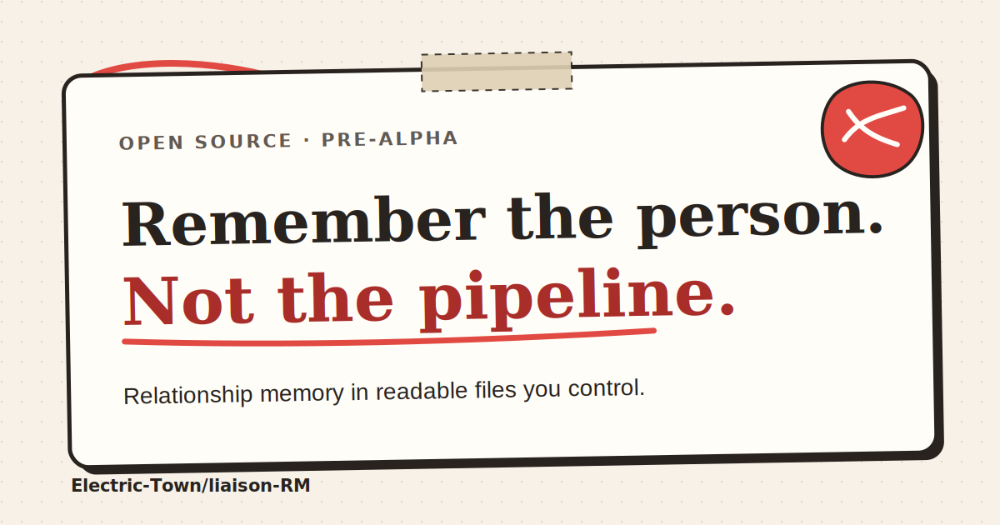

<p align="center">
  <a href="https://electric-town.github.io/liaison-RM/">
    
  </a>
</p>

<p align="center">
  <a href="https://electric-town.github.io/liaison-RM/"><strong>Project site</strong></a>
  · <a href="PROJECT_CONTEXT.md">Current status</a>
  · <a href="SPEC.md">Product contract</a>
  · <a href="CONTRIBUTING.md">Contributing</a>
</p>

# Liaison RM

**Remember the person. Not the pipeline.**

Liaison RM is a local-authoritative relationship memory and attention system. It is for people who want CRM-grade organisation without sales-pipeline assumptions, a hosted relationship vault or a score that pretends message frequency measures closeness.

The product is being built around readable Markdown and YAML records, a shared Rust core, a first-class `liaison` CLI and a native Tauri desktop. Search indexes, caches and graph layouts are projections that can be rebuilt. The workspace stays under the owner’s control.

> [!WARNING]
> **Pre-alpha.** The default branch has a tested workspace, People and CLI slice, a desktop alpha, provider contracts, profile-readiness and reason-only review foundations. It is not ready for daily use or public binary distribution. There are no signed downloads.

## Why this exists

A contact list remembers an address. A sales CRM remembers an opportunity. Neither is built to hold the context that helps someone follow through on a promise, prepare for a meeting, respect a boundary or remember what matters to another person.

Liaison RM takes four positions:

- a person is not a lead;
- frequent contact does not prove trust, affection or importance;
- missing information is a state to resolve, not permission to guess;
- relationship attention needs an honest reason, not a guilt score.

The intended result is simple: capture a useful detail once, find it before it matters and keep the record even if Liaison RM disappears.

## Start here

### Building with a coding agent

Read these files in order before changing code:

1. [`AGENTS.md`](AGENTS.md): normative contributor and agent rules.
2. [`PROJECT_CONTEXT.md`](PROJECT_CONTEXT.md): product, architecture, status, terminology, active work, and handoff context.
3. [Working-state delivery contract](docs/product/working-state-delivery.md): the accepted B0-then-A0 order, current implementation boundary, and reviewed branch dispositions.
4. [Normative traceability appendix](docs/product/traceability.md): atomic requirement, UAT, gate, task, milestone, status, and evidence ownership.
5. [`SPEC.md`](SPEC.md): product and build specification.
6. [`AI_BUILD_INSTRUCTIONS.md`](AI_BUILD_INSTRUCTIONS.md): task selection and implementation sequence.
7. The owning bounded-context README under [`contexts/`](contexts/).
8. Related decisions, knowledge articles, requirements, UAT cases, feature gates, and implementation tasks.

Do not begin with a new screen or provider integration. Start with a dependency-complete vertical slice through domain rules, application services, ports, adapters, CLI or desktop surface, tests, knowledge, and changelog.

### Reviewing the product direction

- [Product and build specification](SPEC.md)
- [Complete agent handoff and current context](PROJECT_CONTEXT.md)
- [Working-state delivery contract](docs/product/working-state-delivery.md)
- [Product roadmap](docs/product/roadmap.md)
- [Normative traceability appendix](docs/product/traceability.md)
- [Context map](docs/architecture/context-map.md)
- [Ubiquitous language](docs/architecture/ubiquitous-language.md)
- [Open workspace format](docs/architecture/open-workspace.md)
- [Provider-neutral connections](docs/architecture/provider-connections.md)
- [Sharing and synchronisation](docs/architecture/sharing-and-synchronization.md)
- [Threat model](docs/security/threat-model.md)
- [Local-integrity requirements](docs/security/local-integrity.md)
- [Interaction prototype and screens](docs/prototypes/README.md)
- [Machine-readable requirements](spec/requirements.json)
- [Persona UAT catalogue](spec/uat-cases.json)
- [Feature gates](spec/feature-gates.yaml)
- [Implementation plan](spec/implementation-plan.yaml)
- [Normative traceability ownership](spec/traceability-ownership.json)
- [Generated traceability report](spec/traceability-report.json)

## What works today

| Surface | On the default branch | Boundary |
|---|---|---|
| Open workspace | Create, inspect and validate a versioned local workspace | Complete crash recovery, migrations and projection rebuild remain gated |
| People | CLI and Rust tests create and list basic person records in readable Markdown | The installed desktop person-create path currently fails at its Tauri argument boundary; the daily Directory and full profile editor are not complete |
| CLI | Human and JSON output for workspace and person commands | Import, edit, backup, sharing and destructive commands remain gated |
| Desktop alpha | The installed app launches and renders local workspace controls | Native QA found the person-create request fields broken (`workspacePath`/`displayName` versus `workspace_path`/`display_name`); review builds are not signed public releases |
| Relationship model | Separate intent, evidence, maintenance status and purpose-specific readiness | Weighted priority and the full relationship workflow are not released |
| Review and Attention | Reason-only policy, hard suppressions and bounded queue foundations | No claim of a complete personal review experience |
| Connections | Versioned object-store contract, grant model and local reference adapter | Upload evidence does not prove safe multi-writer synchronisation |
| Localisation | `en-IE` source catalogue, `en-XA` stress locale and draft locale fixtures | Irish, Japanese and Brazilian Portuguese still require named human review |
| Packaging | macOS review bundles and Windows NSIS build configuration in CI | Signing, notarisation, clean-machine UAT and supported downloads remain closed |

The exact status, current branches and open gates live in [`PROJECT_CONTEXT.md`](PROJECT_CONTEXT.md#2-current-status). Do not treat an open pull request, a prototype or a passing unit test as released behaviour.

## Run the current CLI

This path exercises the implemented Rust application services and Markdown adapter. It creates a disposable workspace with synthetic data.

Requirements: Git and the pinned Rust toolchain from [`rust-toolchain.toml`](rust-toolchain.toml).

```bash
git clone https://github.com/Electric-Town/liaison-RM.git
cd liaison-RM

liaison_demo="$(mktemp -d)"

cargo run --locked -p liaison-cli -- \
  --workspace "$liaison_demo" \
  workspace init --name "Liaison demo" --build-profile connected-local

cargo run --locked -p liaison-cli -- \
  --workspace "$liaison_demo" \
  person create --name "Alex Example" --email "alex@example.test"

cargo run --locked -p liaison-cli -- \
  --workspace "$liaison_demo" \
  workspace validate
```

Use `--output json` before the command group for structured output. See [`apps/cli/README.md`](apps/cli/README.md) for the full current command set and error contract.

## The relationship model

Liaison RM does not collapse a relationship into one number.

| Concept | Meaning | Source |
|---|---|---|
| **Relationship intent** | How the user wants to maintain the relationship, including cadence, boundaries and future state | Manually configured |
| **Relationship evidence** | Interactions, notes, commitments, events and imported history | Recorded or imported facts |
| **Maintenance status** | Whether something needs attention relative to its own configuration | Explainable calculation |
| **Profile readiness** | Whether the information required for a named purpose is known and current | Purpose-specific calculation |

Good review copy names the reason:

```text
Venue shortlist promised for Friday. Last note: keep the room step-free.
```

Rejected copy invents a truth the evidence cannot support:

```text
Relationship strength: 42%.
```

Reason-only review is the default. Archive, do-not-contact, pause, snooze and no-cadence states override review pressure.

## Topic Packs and explicit information states

Profiles are composed from reusable **Topic Packs** rather than one fixed contact form. A pack can describe identity and communication, food and hospitality, travel, important dates, family context, professional roles, accessibility needs, events or resources.

Fields have stable IDs that do not depend on their visible label. Values can be:

- known or verified;
- unverified, stale or conflicting;
- unknown or in need of clarification;
- not applicable;
- declined;
- derived.

An empty allergy, accessibility or dietary field never means “none”. Readiness is calculated for a named purpose such as event catering or a meeting briefing, not as one universal profile-completeness score.

## Open workspace

A Liaison workspace is an ordinary directory the owner can inspect, back up, transform and recover without a hosted service:

```text
workspace/
├── .liaison/
│   ├── workspace.yaml
│   ├── schema-version
│   ├── grants/
│   ├── operations/
│   └── projections/
├── people/
├── organisations/
├── relationships/
├── interactions/
├── reminders/
├── events/
├── attachments/sha256/
└── audit/
```

Human-scale records use Markdown with versioned YAML front matter. Documented JSONL partitions hold high-volume machine streams. Unknown fields and user-authored Markdown sections must survive supported round trips. Secrets never enter canonical files.

The planned first B0 People writer is pinned to the OKF v0.1 Draft Markdown envelope through [ADR 0013](docs/decisions/0013-pin-okf-v0-1-people-authoring-profile.md). OKF supplies the portable envelope; Liaison's versioned domain extension remains authoritative for identity, purpose, revision, provenance, information state, sensitivity, disclosure, and operational meaning. OKF-valid never means Liaison-valid or event-ready, and sealed facts never enter plaintext merely for interoperability. This writer and the required OKF People normalization are planned contracts, not capabilities in the current alpha.

Read the full storage contract in [`docs/architecture/open-workspace.md`](docs/architecture/open-workspace.md).

## Architecture

```text
Desktop / CLI / local API / MCP / importer / plugin adapter
                              ↓
                    application command or query
                              ↓
                      owning domain model
                              ↓
                        outbound port
                              ↓
                           adapter
```

Domain rules live in the owning bounded context. React, Tauri commands, providers, importers, plugins and AI tools call application services; they do not reimplement those rules.

| Area | Direction |
|---|---|
| Core | Rust domain and application services |
| Desktop | Tauri 2; current frontend calls typed Tauri commands |
| CLI | First-class `liaison` binary using the same services |
| Canonical records | Markdown/YAML plus documented JSONL streams |
| Projections | Disposable SQLite, search, graph layout, thumbnails and caches |
| Providers | Versioned capability contracts with explicit grants |
| Plugins | WASI Component Model and WIT with denied-by-default capabilities |
| Automation | Planned loopback OpenAPI, webhooks, MCP and local-model mediation |

Start with the [context map](docs/architecture/context-map.md), [ubiquitous language](docs/architecture/ubiquitous-language.md) and [accepted decisions](docs/decisions/README.md).

## Privacy and safety boundary

Liaison RM may hold sensitive personal, dietary, accessibility, calendar, workplace and private relationship context. The repository requires:

- explicit purpose, scope and expiry before data leaves the workspace;
- least-disclosure exports and previews;
- no hidden telemetry, remote logging, account check or licence check;
- no automatic messages without user action;
- no employee, productivity, attendance-compliance or risk scoring;
- no private assessment in shared search, exports, AI context or provider data;
- no personal data sent to a model without an explicit grant.

Airgap and Connected-local are separate build profiles. A runtime toggle is not proof of an Airgap build.

Read the [threat model](docs/security/threat-model.md), [local-integrity requirements](docs/security/local-integrity.md) and [sharing architecture](docs/architecture/sharing-and-synchronization.md).

## Accessibility and language

The project targets WCAG 2.2 Level AA and applicable EN 301 549 evidence. This is an engineering target, not a certification claim.

User-facing work must support keyboard completion, visible focus, screen-reader names, 400% zoom and reflow, reduced motion, interruption recovery, long content and a semantic alternative to graph-only or drag-only interaction.

`en-IE` is the source locale. Draft `ga-IE`, `ja-JP` and `pt-BR` catalogues are not released translations. A locale needs a named fluent reviewer, product-context review, layout evidence and accessibility sampling before it can appear in a production language selector.

See the [UX review standard](docs/standards/ux-review.md), [language-quality standard](docs/standards/localization-and-language-quality.md) and [current locale evidence](docs/evidence/localization/README.md).

## Build order

The accepted working order is P00 through P11, B0 acceptance, then A0. The broader R0–R6 catalogue remains long-term scope, not merge order.

| Gate | Outcome |
|---|---|
| **P00–P03** | Reconciled contracts, one typed application/session boundary, and recoverable canonical operations |
| **P03 design gate** | Design consultation creates `DESIGN.md`, then plan design review approves the P04 direction |
| **P04–P08** | Typed accessible desktop system, accessible built-in themes, versioned B-domain contracts, scalable Directory, local security, checkpoints, and encrypted recovery packages |
| **P09–P11** | Directory import, exact event dietary readiness, least-disclosure brief delivery, and the complete installed desktop workflow |
| **B0** | Workplace Review Alpha with pinned strict-write/tolerant-read OKF People records, required failure-atomic People normalization, exact event readiness, and qualification in a freshly installed universal Mac review application |
| **A0** | Personal Memory Alpha with source-complete purpose-scoped profiles, user-organised tabs, reversible identity review, source/range timeline, bounded commitments, reason-only Review, no global person score or automatic merge, and accessible appearance settings without regressing B0 |
| **After A0** | General and third-party migrations, declarative theme packages, sharing, visible provider operations without hidden sync, mobile, Meitheal, CardDAV/calendars/email, facilities, spatial discovery, OpenAPI, MCP, staged AI proposals, and plugins as independent gates |

The first operational wedge is event dietary readiness: select an attendee cohort, identify every unresolved coverage state and produce a least-disclosure catering brief.

## Current work
The [working-state delivery contract](docs/product/working-state-delivery.md) and [generated traceability appendix](docs/product/traceability.md) record the accepted B0 Workplace Review then A0 Personal Memory sequence, current implementation truth, and reviewed branch dispositions. Repository state still changes quickly: verify the default-branch head, open pull requests, changed files, and exact-head checks before using any branch as a dependency.

B0 includes the required OKF People normalization only; general and third-party migrations remain later work. Across all releases, Liaison prohibits a global person score, a generic task engine, automatic exact/fuzzy identity merge, direct AI writes to confirmed facts, and hidden provider sync, refresh, or egress.

An open PR, prototype, screenshot, workflow definition, and installed application are different evidence classes. None proves that planned behaviour is on `main` or release-ready.

## Validate a change

Run the checks required by the changed scope. The baseline is:

```bash
python3 scripts/check_repository.py
python3 scripts/check_spec.py
python3 scripts/check_architecture.py
python3 scripts/check_providers.py
python3 scripts/check_wit_contract.py
cargo fmt --all --check
cargo check --workspace --all-targets --all-features --locked
cargo clippy --workspace --all-targets --all-features --locked -- -D warnings
cargo test --workspace --all-features --locked
```

Public-site changes also run:

```bash
python3 scripts/check_public_site.py
```

Tests only support claims when they ran against the submitted commit. Platform packaging, browser behaviour, provider conformance and releases need their own exact-head evidence.

## Project map

```text
apps/                 Desktop, CLI and local services
contexts/             Bounded contexts and application services
crates/               Narrow shared technical libraries
adapters/             Filesystem, projection and provider adapters
interfaces/           WIT, OpenAPI, MCP and external contracts
providers/            Optional provider packages and evidence
docs/                 Product, architecture, security, knowledge and evidence
spec/                 Requirements, UAT, feature gates and build order
site/                 Static source for the public GitHub Pages site
scripts/              Repository, contract and site checks
```

The [public-site runbook](docs/public-site.md) explains deployment, metadata, locale and rollback rules.

## Contributing

Read [`CONTRIBUTING.md`](CONTRIBUTING.md) and the [pull-request template](.github/pull_request_template.md). Every behavioural change states the user problem, context owner, evidence, privacy effect, accessibility effect, compatibility path, exact tests and remaining gates.

The project is KCS-informed. Search existing knowledge first, improve it while solving the task and leave enough context for the next contributor. The repository does not claim KCS certification.

## Inspirations and migration sources

Liaison RM learns from [Meerkat CRM](https://github.com/fbuchner/meerkat-crm), [CRM in Markdown](https://github.com/CLSherrod/crm-markdown), [Monica](https://github.com/monicahq/monica/tree/4.x), [Logseq](https://logseq.com/) and [Obsidian](https://obsidian.md/). It is not a fork of those projects.

Any code reuse requires licence review and attribution. Product inspiration does not imply endorsement or affiliation.

## Licence

Liaison RM is licensed under the [GNU Affero General Public License v3.0](LICENSE).
