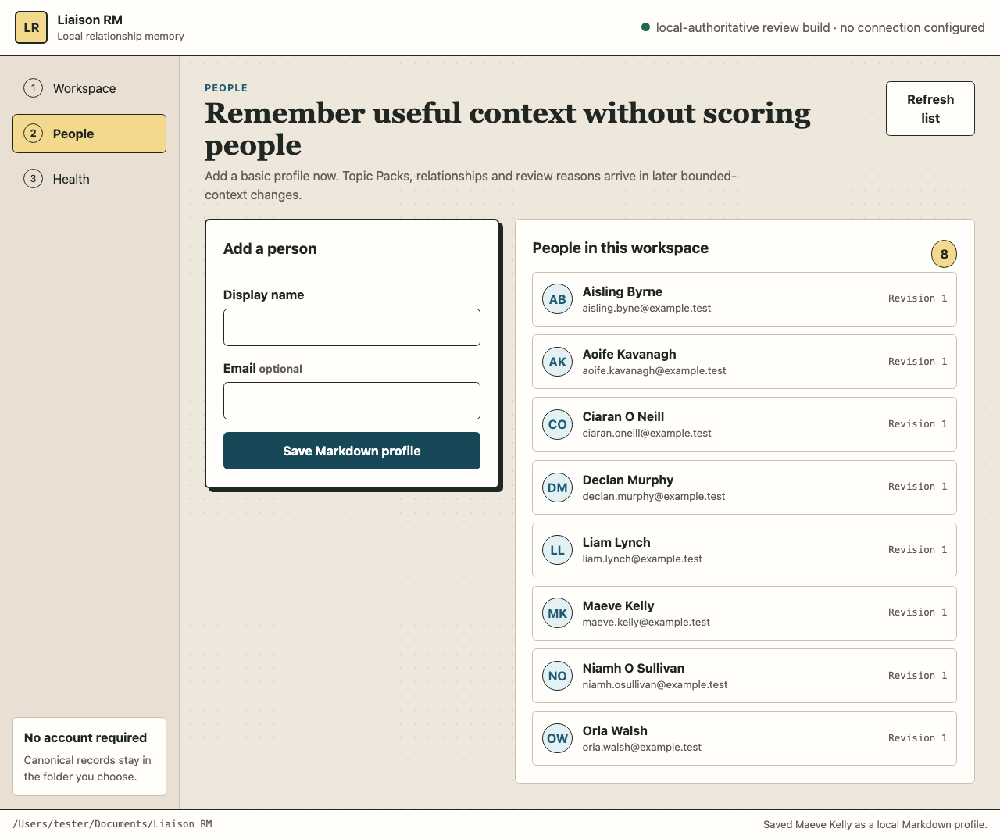
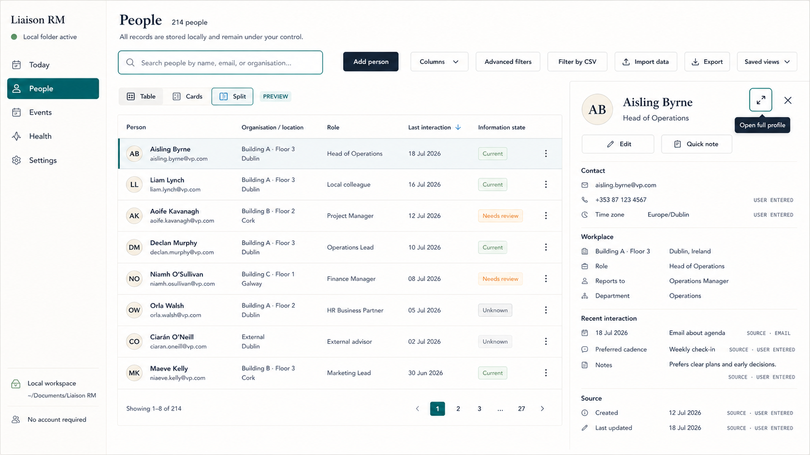
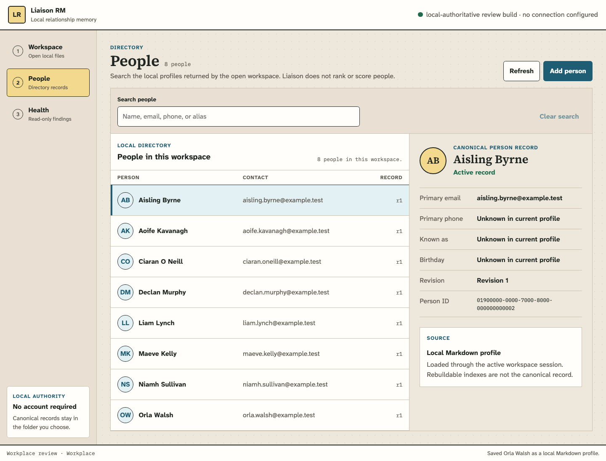
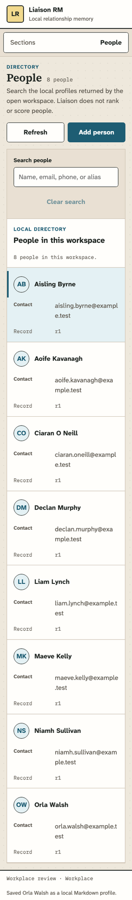
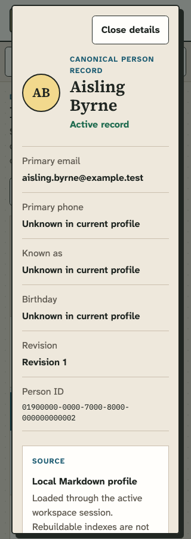

# People directory design review evidence

**Date:** 2026-07-22  
**Surface:** `apps/desktop/ui/` People tab  
**Branch:** `vscode/production-readiness-audit-20260722`  
**Implementation commits:** `85ee0b9`, `a309f89`, `d9a2866`  
**Claim boundary:** complete reconciliation of the current P03 Person create/list
review surface with the approved People directory treatment. This is not P04,
B0, installed-Mac, screen-reader, packaging, or release qualification.

## Problem and authority

At baseline commit `06b16f0`, the populated People tab was a two-card setup
scaffold. A permanent create form and a large principle statement dominated the
page; the passive record cards had no search, selection, or inspectable
canonical detail. At 768 CSS pixels the two columns collapsed into unreadable
character-width content.

The approved shotgun direction is the hybrid C+B+A decision recorded in the
full-screen atlas. For People, the C treatment supplies the visual hierarchy:
a full-canvas directory, compact title and count, search-first results, a flat
semantic table, and selected-record detail. The atlas is a visual reference,
not authority to expose later capabilities.

Authority order used for this reconciliation:

1. current traceability and P03/P04 delivery boundary;
2. `DESIGN.md` and `docs/standards/ux-review.md`;
3. active application/Tauri Person create/list contract and KCS-0010;
4. the approved shotgun atlas.

The approved atlas image has SHA-256
`0c8e826a5152464fa28f69b2a2436b9cc7f802c9ea0a1a9e987b61ad7b702b9f`.

## Before, approved, and implemented

| Baseline | Approved visual target | Implemented P03 surface |
|---|---|---|
|  |  |  |

The implementation adopts the approved composition without fabricating
capabilities:

- the page now leads with `People`, a live record count, and concise local-file
  copy;
- client-side search covers display name, aliases, email addresses, and phone
  numbers already returned by the active workspace session;
- results use a semantic table with keyboard-operable selected rows and a
  read-only canonical detail region;
- the detail exposes only fields present in the current Person projection and
  labels missing values `Unknown in current profile` rather than inferring
  verified none;
- Person creation is a deliberate native dialog rather than a permanent
  populated-state card;
- no-workspace, empty, loading, no-result, success, form-error, and native-busy
  states retain a visible next action or recovery direction;
- at 900 CSS pixels the shell becomes a named `Sections` control and record
  detail moves to a focused dialog; at 620 CSS pixels the table reflows into
  labelled summary rows without changing its semantic source order.

The atlas's edit, quick note, column choice, advanced filters, CSV filtering,
import, export, saved views, organisation, role, interaction history, and
custom profile content remain absent. Events, Today, Settings, and browser
`localStorage` theme persistence also remain absent. Those are not current P03
People capabilities. The active workspace identity remains visible without
repeating its sensitive absolute path in every view, as required by
`DESIGN.md`.

## Responsive evidence

| 320 CSS-pixel directory | 320 CSS-pixel selected detail |
|---|---|
|  |  |

Rendered measurements from the deterministic local bridge harness:

- 1440×900: no horizontal overflow; no visible target under 44×44 CSS pixels;
  minimum visible target height 47 pixels;
- 320×900: no horizontal overflow; no visible target under 44×44 CSS pixels;
  minimum visible target height 47 pixels;
- 200% root text size at 1440 CSS pixels: document width remained 1440 with no
  horizontal overflow;
- the 320 CSS-pixel layout is the 1280-pixel desktop-width proxy for 400% zoom;
- selected detail opened with its heading focused, had no horizontal overflow,
  and Escape returned focus to the originating row;
- the exact local Atkinson Hyperlegible Next, Source Serif 4, and IBM Plex Mono
  subsets loaded successfully; there were no console errors or non-file
  network requests.

## UX review

### ADHD, AuDHD, AskTog, and Gestalt

The current location, record count, search state, selected record, native busy
state, and last operation status are visible. Search and selection do not
change canonical files. Create is progressively disclosed, names one outcome,
and restores focus when dismissed. Stable navigation and a single flat work
surface reduce mode and card noise. Proximity groups search with results and
selected detail with its provenance; selected state is communicated by
`aria-pressed`, a border, and background rather than colour alone. There is no
timer, auto-advance, drag interaction, graph-only view, relationship score, or
surprise reordering.

### Nielsen's ten heuristics

| Heuristic | Evidence |
|---|---|
| Visibility of system status | Live Person count, result count, selected state, `aria-busy`, local-authority state, and operation status |
| Match with the real world | `People`, `local profile`, `workspace`, `revision`, and `source` match the canonical file model |
| User control and freedom | Clear search, Cancel, Close details, Escape, and focus return are verified |
| Consistency and standards | Native table, search input, buttons, description list, and dialogs use platform semantics |
| Error prevention | Required name, email input type, disabled session actions, and globally serialised native operations |
| Recognition rather than recall | Visible labels, selected row, field names, count, and source/provenance; no icon-only actions |
| Flexibility and efficiency | Search narrows the already-loaded directory and row selection exposes detail without navigation |
| Aesthetic and minimalist design | One directory surface; create form, duplicate no-result action, and implementation notices removed |
| Error recovery | Workspace, form, native bridge, no-results, and validation states name a recovery direction |
| Help and documentation | Local-authority note and canonical-source detail explain storage; KCS-0010 documents the shared application workflow |

### Accessibility and content checks

- The accessibility snapshot exposes one People H1, the local-directory H2,
  semantic table caption and headers, pressed state, named search, and named
  row buttons.
- Keyboard creation, row selection, narrow-detail dialog operation, Escape,
  and focus restoration are browser-tested.
- Reduced-motion and dark-mode checks remain in the full desktop suite; forced
  colours receive explicit borders and selected-row treatment.
- The semantic-token validator passes all text/action pairs. Its low-contrast
  flags are decorative surface borders/highlight adjacency, not the sole
  carrier of state or action.
- The focused regression includes a deliberately long Person name and email,
  the 320 CSS-pixel no-overflow assertion, and an active-search no-results
  state.
- Copy says `Unknown in current profile` for absent fields and never converts
  absence into a factual none state.
- The current hard-coded review strings are not represented as completed P04
  localisation. An installed macOS VoiceOver run was not performed, so this
  evidence must not be reused as screen-reader or release qualification.

## Exact verification

The following checks passed on the shared worktree after `d9a2866`; concurrent
Events/domain changes were present but were neither edited nor staged by this
work:

```text
node --check apps/desktop/ui/app.js
python3 -m py_compile scripts/test_desktop_ui.py scripts/test_people_directory_design.py
python3 scripts/check_desktop_shell.py
python3 scripts/check_design_tokens.py
/private/tmp/liaison-design-pw-venv/bin/python scripts/test_people_directory_design.py
/private/tmp/liaison-design-pw-venv/bin/python scripts/test_desktop_ui.py
```

Results:

- focused People regression: search, selected canonical detail, no-results,
  long content, 320 CSS-pixel reflow, dialog focus return, and zero external
  requests passed;
- full desktop suite: native-operation serialisation, workspace
  switching/rollback, dual-close restart recovery, stale-Person isolation,
  validation, focus recovery, mobile reflow, dark mode, and zero external
  requests passed;
- static desktop shell and design-token checks passed;
- deterministic rendered harness loaded in 12 ms with only the HTML and three
  bundled font files requested.

## Final assessment

- **Design: A-** — the current capability set now has the approved directory
  hierarchy, interaction model, and responsive treatment. It intentionally
  lacks later atlas functions.
- **AI-slop check: A** — the stacked-card app-UI hard rejection is removed;
  the result uses a flat data workspace, purposeful typography, restrained
  palette, and domain-specific provenance.
- **Goodwill: 90/100** — trust gains come from immediate search, inspectable
  local provenance, honest unknown states, keyboard continuity, and clear
  capability limits. The remaining ten points are reserved for the future
  installed-app, localisation, VoiceOver, and P04/B0 qualification gates.

