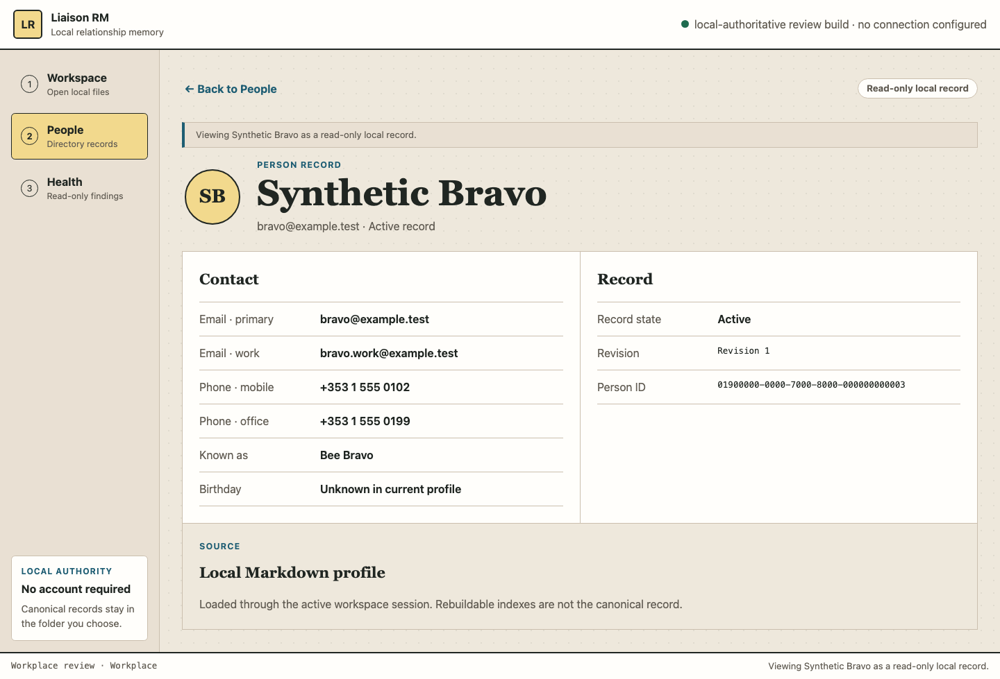
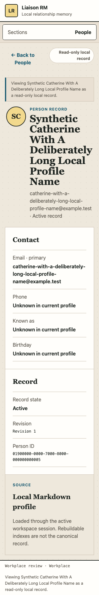

# People directory design-review evidence

**Date:** 2026-07-22
**Surface:** `apps/desktop/ui/` People and read-only Person record surfaces
**Branch:** `vscode/production-readiness-audit-20260722`
**Source fixes:** `da3e753`, `2b13143`
**Evidence class:** candidate source and deterministic browser evidence only

This document replaces the earlier split-detail assessment. The earlier review
used the route-sized atlas export as the People interaction target and therefore
accepted the wrong composition. The user identified the mismatch and supplied
the original approved board. Rechecking the approval provenance shows that the
approved hybrid assigns the People foundation to Option C: a full-canvas table
directory and a separate Person screen.

The historical exact-artifact review at `3499a6e` and its P03O observation remain
useful evidence of what that artifact contained. A later security audit found a
real recoverability defect in the same source: `COMPLETE` could become durable
before projection invalidation, recovery could therefore skip a missing effect,
and completion/recovery receipts were dropped before the application boundary.
P03 is consequently reopened. Machine truth on this branch is `T-B0-P03`
current, with `T-B0-P03D`, `T-B0-P04`, and A0 blocked. This newer candidate
remediates that reopened invariant but still requires new exact-head and artifact
evidence. It is not accepted P03/P03O/P03D/P04/B0, installed-Mac, packaging,
screen-reader, or release evidence.

## Approval provenance and conflict resolution

The source decision is:

- board: `http://127.0.0.1:63492/boards/b-20260721-211849-re4u0i/`;
- decision record:
  `/Users/winks/.gstack/projects/Electric-Town-liaison-RM/designs/full-app-remix-20260721-round2/approved.json`;
- approved direction: `hybrid-C+B+A`;
- People assignment: Option C supplies the application shell and
  **full-canvas People directory**;
- user confirmation recorded by the decision: `yep exactly, agreed`;
- Option C image SHA-256:
  `f6fd5d3ef54fbf6aac816daa9749b95d81184d7b80b8267d2dd826748c1ab0fe`.

The later route-sized atlas contains a conflicting split-detail
`people/directory.png`, SHA-256
`0c8e826a5152464fa28f69b2a2436b9cc7f802c9ea0a1a9e987b61ad7b702b9f`.
Its manifest explicitly says `implementation_authority: false`. The atlas README
also says the rasters are not implementation or WCAG evidence. The source
approval therefore governs the composition: Option C's table-first Directory
and separate Person screen. The atlas remains useful for typography, palette,
responsive mood, and future route references.

## Before, approved, and corrected

| Earlier split implementation | Approved Option C | Corrected candidate directory |
|---|---|---|
| The directory reserved a permanent right column for an automatically selected record. At narrow widths it changed into a detail dialog. |  |  |

The corrected implementation now follows the approved information architecture:

- People is a full-width, table-first data workspace;
- search, Add person, and Refresh share one compact task toolbar;
- the directory no longer auto-selects a record or reserves a split panel;
- the semantic table exposes only fields returned by the current workspace
  contract: Person, email, phone, active/archived record state, and revision;
- opening a row goes to a separate read-only Person record surface;
- Back to People restores focus to the originating row and retains stable
  selected-row semantics;
- the separate surface exposes only current projection fields: display name,
  every labelled email and phone, aliases, birthday, archived state, revision,
  identifier, and local Markdown source;
- absent fields say `Unknown in current profile`; they are never converted to a
  factual none state;
- the Add person dialog remains the only current mutation and still uses the
  existing session-scoped `create_person` command;
- a failed Refresh preserves the last successfully loaded rows but labels them
  stale inline, associates the warning with the table, and names Retry Refresh;
- page-local operation status remains next to the active work at narrow reflow,
  and Person navigation replaces stale prior-operation copy;
- the read-only mode is programmatically described by the focused Person H1,
  while provenance typography is applied explicitly to revision and identifier
  values rather than by row position.

## Capability redline

The approved visual direction spans later delivery packages. The following
controls or content remain structurally absent because no current owning service
backs them:

- configurable columns, compound filters, Filter by CSV, import, export, saved
  views, and pagination services;
- organisation/location, role, interaction history, notes, important dates,
  commitments, workplace memberships, custom fields, and personal user manual;
- edit profile, quick note, archive/restore, relationship status, and profile
  customisation;
- Today, Events, Settings, provider, account, and browser-storage theme
  capabilities.

Their absence is an authority constraint, not a visual omission to paper over
with disabled or non-functional controls.

## Responsive and interaction evidence

| 320 CSS-pixel Directory | Desktop Person record | 320 CSS-pixel Person record |
|---|---|---|
|  |  |  |

Deterministic local-bridge measurements:

- 1440×900 Directory: document width equals the 1440-pixel viewport;
- directory surface width: 1146 pixels; results width: 1144 pixels, confirming
  the table owns the complete inner work surface;
- no visible interactive element measured below 44×44 CSS pixels;
- 768×900 Directory: no horizontal overflow and rows reflow to labelled
  summaries;
- 320×900 Directory and Person: no horizontal overflow;
- Person heading receives focus on open;
- Person navigation resets to the top before heading focus, including when the
  originating row was near the end of a long 320-pixel Directory;
- Back to People restores focus to the originating row;
- the three bundled local fonts are the only rendered font families;
- the deterministic harness recorded no console errors and no external network
  requests.

Evidence-image SHA-256 values:

- approved Option C: `f6fd5d3ef54fbf6aac816daa9749b95d81184d7b80b8267d2dd826748c1ab0fe`;
- corrected 1440-pixel Directory: `8818bf9da4e7e13abda2fcb72842d41146bdc8a6a66e683da39845e2d237a22d`;
- corrected 320-pixel Directory: `422ca2f8ce4ebd143eedffa4e704b4efde6696ff56e223779717e45fd3f3f513`;
- corrected 1440-pixel Person: `9debfc33add861e469da1ad3d2b4d1a39a272553167cca4803407bb9b28bc18a`;
- corrected 320-pixel Person: `b30142ba5437395187b4d54ec116ca26092bb55a1c3b08a94cb381dd028df2e3`.

## UX review

### ADHD, AuDHD, AskTog, and Gestalt

The current location, record count, active search, selected record, native busy
state, stale-directory warning, and page-local operation status remain visible.
The top task is no longer
obscured by a permanently open detail mode. Opening a record is a deliberate
spatial transition with an obvious Back action, and focus continuity means an
interruption does not force the user to rediscover the row. Search and
inspection remain non-mutating; creation is progressively disclosed.

The layout groups search and actions above one flat dataset. Person facts and
record provenance are separate, named regions. There is no timer, auto-advance,
drag interaction, graph-only view, relationship score, surprise reorder, or
colour-only selected state.

### Nielsen's ten heuristics

| Heuristic | Candidate evidence |
|---|---|
| Visibility of system status | People count, filtered result count, `aria-busy`, selected row, stale Refresh state, local-authority label, and page-local operation status |
| Match with the real world | People, Person record, Contact, Record state, Revision, and Source match current local-file vocabulary |
| User control and freedom | Clear search, Cancel, Back to People, and deterministic focus return |
| Consistency and standards | Semantic table, labelled controls, description lists, one native creation dialog, and one separate detail surface |
| Error prevention | Required name, email input type, disabled session actions, and globally serialised native operations |
| Recognition rather than recall | Visible labels, count, current row, field names, and source; no icon-only primary actions |
| Flexibility and efficiency | Search narrows already-loaded records; row activation and Back preserve context |
| Aesthetic and minimalist design | One directory workspace; no permanent split inspector or fabricated toolbar controls |
| Error recovery | Workspace, form, bridge, empty, loading, and no-results states name a next action |
| Help and documentation | Local-authority and source copy explain storage without claiming P04 or release maturity |

### Accessibility and content checks

- The accessibility tree exposes one visible People H1, an All people H2, a
  captioned table with five column headers, named row buttons, and a distinct
  Person H1 after navigation.
- Keyboard creation, search across name/email/phone/alias, Refresh success and
  recovery, row activation, separate-page navigation, and focus return are
  browser-tested.
- The Person heading is described by the read-only badge and record summary;
  all labelled contact values returned by the current DTO remain inspectable.
- The table converts to an equivalent labelled summary at the narrow breakpoint;
  it does not require primary horizontal scrolling.
- Reduced-motion, dark-mode, forced-colours, and local-only asset rules remain
  in the shared shell.
- Long Person names and emails are included in the responsive render.
- An installed macOS VoiceOver run, translated catalogues, and installed 400%
  zoom evidence were not performed here and remain unclaimed.

The applicable workflow boundary is documented in
`docs/knowledge/KCS-0010-how-do-inbound-adapters-run-the-same-workflow.md`:
the fake bridge is interaction evidence, not native WebKit, filesystem,
recoverability, or release proof.

## Verification at exact source head `2b13143`

The following passed after `2b13143`; concurrent Events/domain work remained
outside this task:

```text
node --check apps/desktop/ui/app.js
python3 -m py_compile scripts/test_desktop_ui.py scripts/test_people_directory_design.py
python3 scripts/check_desktop_shell.py
python3 scripts/check_design_tokens.py
/private/tmp/liaison-design-pw-venv/bin/python scripts/test_people_directory_design.py
/private/tmp/liaison-design-pw-venv/bin/python scripts/test_desktop_ui.py
```

The focused test verifies full-width table ownership; every backed search field;
Add focus and non-selection; Refresh busy, success, failure, stale, and retry
states; structural absence of the old split/detail dialog and later controls;
all labelled contacts; separate read-only Person navigation; page-local status;
explicit provenance styling; long-content 320-pixel reflow; Back focus/context
return; and zero external requests. The full suite retains operation
serialisation, workspace switch and rollback, stale-Person isolation,
validation, narrow reflow, dark mode, and zero-external-request coverage.

## Assessment

- **Design score: D → A- within the current candidate capability set.** The
  incorrect split interaction was polished but contradicted the approved
  composition. The corrected surface now follows the full-canvas Directory and
  separate Person information architecture.
- **AI-slop score: A → A.** Both versions avoided generic marketing patterns;
  the correction improves product-specific task hierarchy rather than adding
  decoration.
- **Goodwill: 68 → 88.** The largest gain is that People now behaves like a
  directory and record opening has a predictable destination and return path.

Status: **DONE_WITH_CONCERNS** — the People candidate source is corrected and
browser verified. Repository machine truth remains P03 current; P03D, P04, B0,
installed-app, localisation, and VoiceOver gates remain separate and closed.
