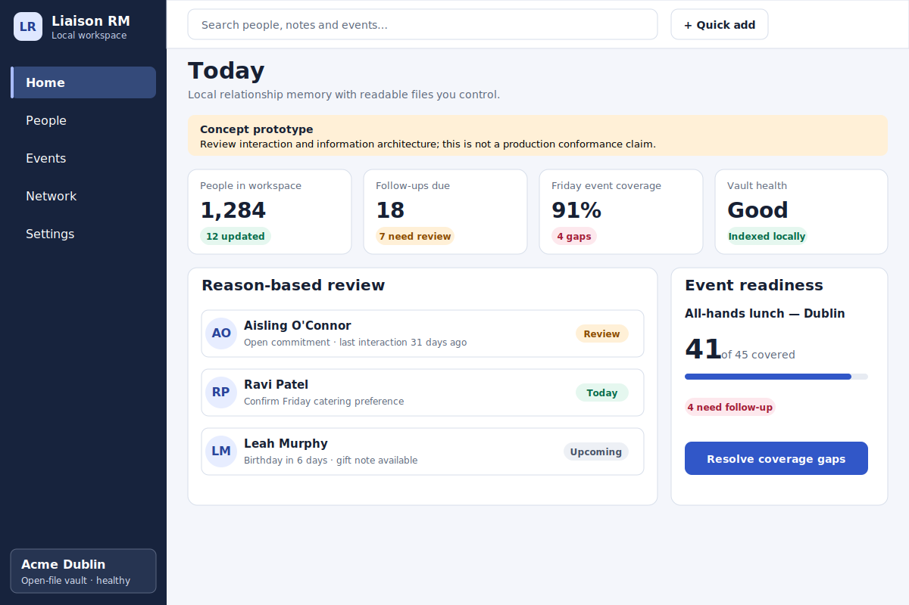
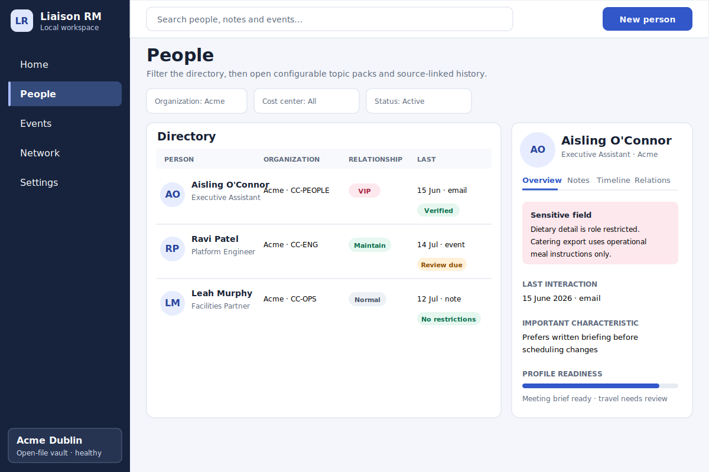
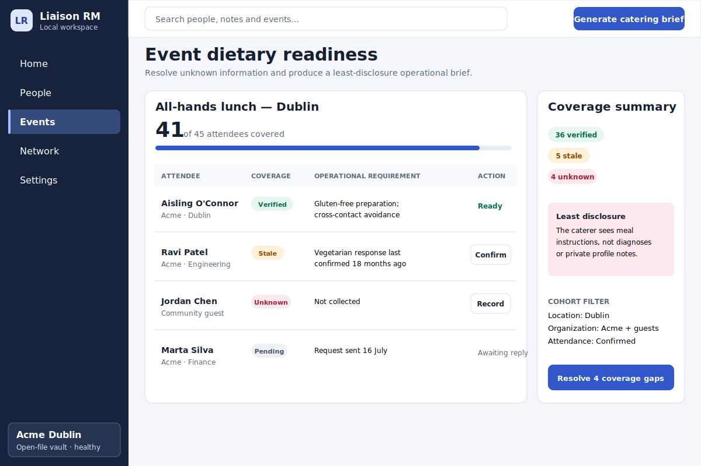
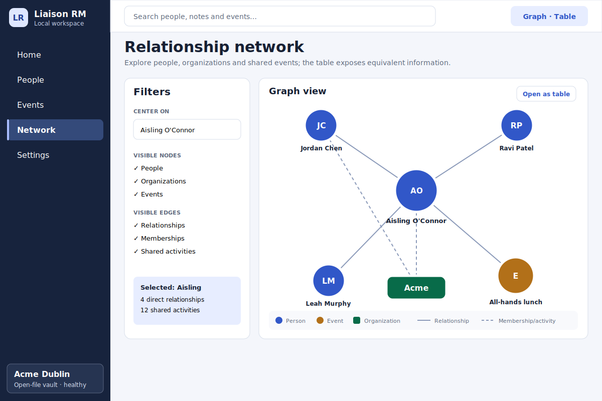
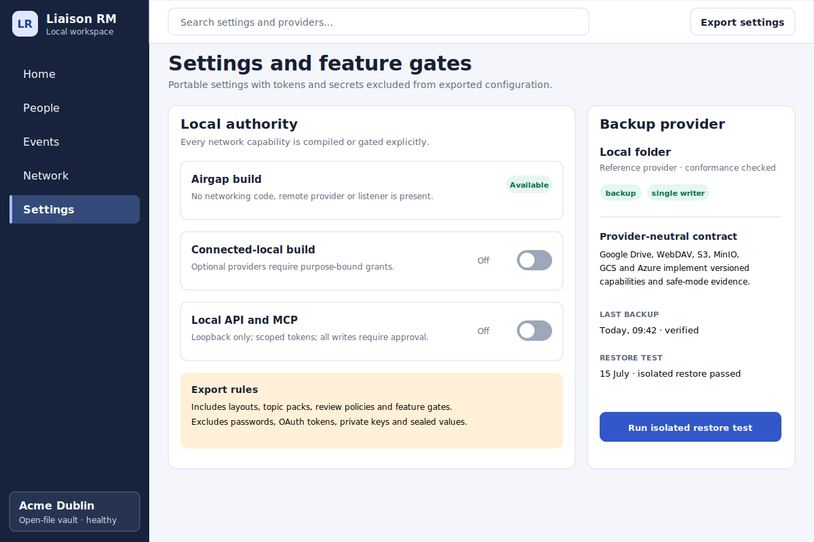
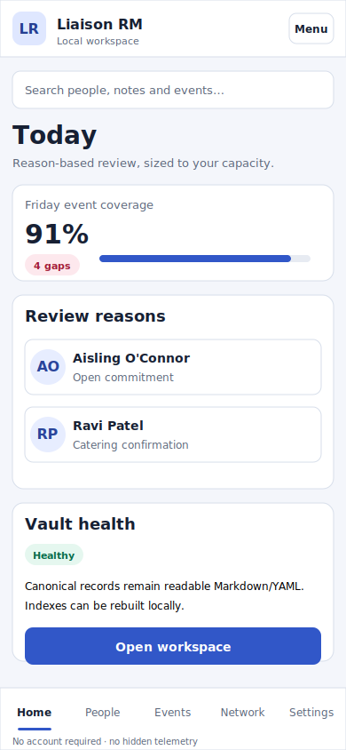
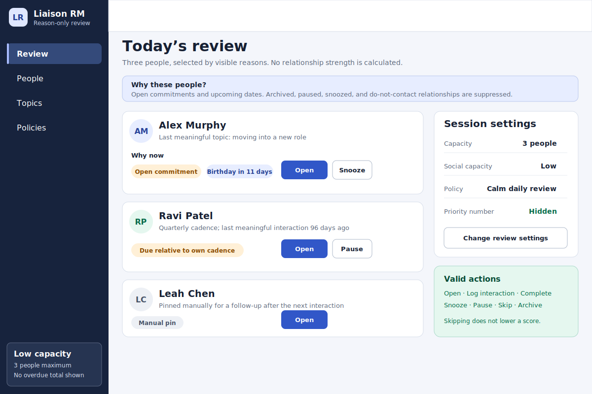
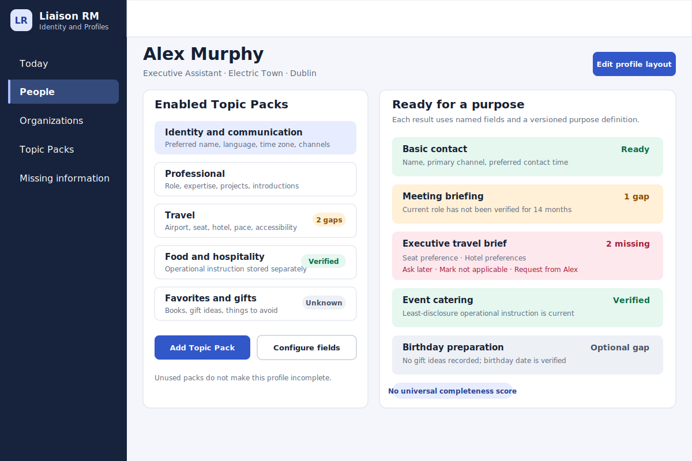
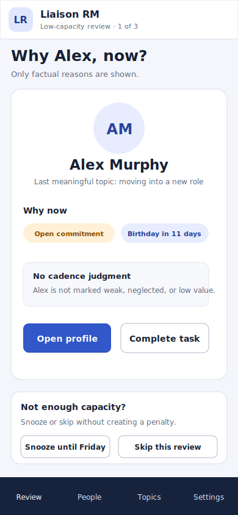

# Liaison RM interaction prototypes

This directory contains reviewable interaction artifacts used to establish information architecture before production interfaces are declared complete.

The prototypes are deliberately static. They demonstrate navigation, profile tabs, event dietary readiness, network graph and semantic table modes, feature gates, reason-only review, purpose-specific profile readiness, keyboard interaction, responsive layout, reduced-motion behaviour, and local-authority messaging. They do not claim production accessibility, privacy, security, or platform conformance.

Open [`liaison-rm-review.html`](liaison-rm-review.html) in a browser to exercise the original application concept.

## Core application screens

### Today



### People and profile



### Event dietary readiness



### Relationship network



### Settings and feature gates



### Mobile dashboard



## Relationship memory and attention screens

### Reason-only daily review



### Purpose-specific profile readiness



### Low-capacity mobile review



## Review focus

Reviewers should check:

- whether the next action is clear without relying on colour;
- whether every surfaced person has a factual explanation;
- whether infrequent contact is kept separate from relationship value;
- whether the interface supports interruption recovery and low-capacity review;
- whether unused Topic Packs avoid creating universal completeness pressure;
- whether sensitive dietary information is separated from operational catering output;
- whether graph information has an equivalent semantic table;
- whether settings explain local, Airgap, and Connected-local behaviour accurately;
- whether the layout remains usable at 390 CSS pixels and with text expansion;
- whether wording avoids guilt, gamification, sales language, and unsupported claims.

## Validation

The original interaction concept uses:

```bash
python -m pip install playwright==1.57.0
python -m playwright install chromium
python scripts/test_prototype.py
```

The relationship model and its three additional SVG screens use:

```bash
python -m pip install PyYAML==6.0.2
python scripts/check_relationship_model.py
```

The images are reviewer evidence, not production conformance evidence.
